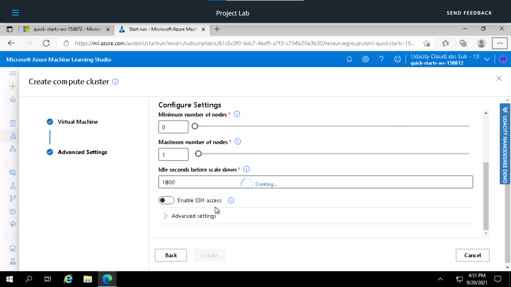

# Operationalizing Machine Learning
### Overview : 
This project is part of the Udacity Azure ML Nanodegree. In this project, we use Azure to configure a cloud-based machine learning production model, deploy it, and consume it. We also create, publish, and consume a pipeline.

## Architectural Diagram

## Key Steps
In this project, you will following the below steps:

1. **Authentication** : In this step, we need to create a Security Principal (SP) to interact with the Azure Workspace. Since I used the Udacity lab for the project, I skipped this step
2. **Automated ML Experiment** : In this step, we create an experiment using Automated ML, configure a compute cluster, and use that cluster to run the experiment.
3. **Deploy the best model** : Deploying the Best Model will allow us to interact with the HTTP API service and interact with the model by sending data over POST requests.
4. **Enable logging** : Logging helps monitor our deployed model. It helps us know the number of requests it gets, the time each request takes, etc.
5. **Swagger Documentation** : In this step, we consume the deployed model using Swagger.
6. **Consume model endpoints** : We interact with the endpoint using some test data to get inference.
7. **Create and publish a pipeline** : In this step, we automate this workflow by creating a pipeline with the Python SDK.

## Detailed Description of the steps

### 1. Authentication
I used the lab Udacity for this exercise, so I skipped this step since I'm not authorized to create a security principal.

### 2. Automated ML Experiment
In this step, I created an AutoML experiment to run using the [Bank Marketing](https://automlsamplenotebookdata.blob.core.windows.net/automl-sample-notebook-data/bankmarketing_train.csv) Dataset which was loaded in the Azure Workspace, choosing **'y'** as the target column.

*Figure 1: Selecting Bank Marketing Dataset*

I uploaded this dataset into Azure ML Studio in the *Registered Dataset* Section using the url provided in the project.

For the compute cluster, I used the **Standard_DS12_v2** for the Virtual Machine and 1 as the **minimum number of nodes**.

I ran the experiment using classification, without enabling Deep Learning. The run took some time to test various models and found the best model for the task.

*Figure 2 - 6: Configuring the auto-ml run*

## Screen Recording
*TODO* Provide a link to a screen recording of the project in action. Remember that the screencast should demonstrate:

## Standout Suggestions
*TODO (Optional):* This is where you can provide information about any standout suggestions that you have attempted.
