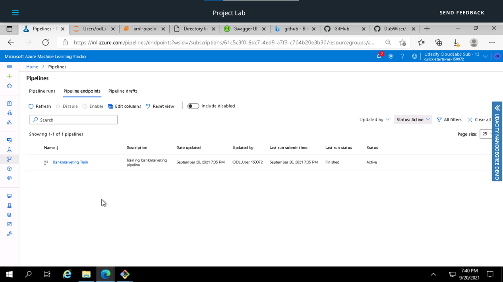

# Operationalizing Machine Learning in Azure ML
### Overview : 
This project is part of the Udacity Azure ML Nanodegree. In this project, we use Azure to configure a cloud-based machine learning production model, deploy it, and consume it. We also create, publish, and consume a pipeline.

## Architectural Diagram

## Key Steps
In this project, you will following the below steps:

1. **Authentication** : In this step, we need to create a Security Principal (SP) to interact with the Azure Workspace. Since I used the Udacity lab for the project, I skipped this step
2. **Automated ML Experiment** : In this step, we create an experiment using Automated ML, configure a compute cluster, and use that cluster to run the experiment.
3. **Deploy the best model** : Deploying the Best Model will allow us to interact with the HTTP API service and interact with the model by sending data over POST requests.
4. **Enable logging** : Logging helps monitor our deployed model. It helps us know the number of requests it gets, the time each request takes, etc.
5. **Swagger Documentation** : In this step, we consume the deployed model using Swagger.
6. **Consume model endpoints** : We interact with the endpoint using some test data to get inference.
7. **Create and publish a pipeline** : In this step, we automate this workflow by creating a pipeline with the Python SDK.

## Detailed Description of the steps

### 1. Authentication
I used the lab Udacity for this exercise, so I skipped this step since I'm not authorized to create a security principal.

### 2. Automated ML Experiment
In this step, I created an AutoML experiment to run using the [Bank Marketing](https://automlsamplenotebookdata.blob.core.windows.net/automl-sample-notebook-data/bankmarketing_train.csv) Dataset which was loaded in the Azure Workspace, choosing **'y'** as the target column.

*Figure 1: Selecting Bank Marketing Dataset*

I uploaded this dataset into Azure ML Studio in the *Registered Dataset* Section using the url provided in the project.

For the compute cluster, I used the **Standard_DS12_v2** for the Virtual Machine and 1 as the **minimum number of nodes**.

I ran the experiment using classification, without enabling Deep Learning. The run took some time to test various models and found the best model for the task.

*Figure 2 - 6: Configuring the auto-ml run*

Select the Virtual Machine - **Standard_DS12_v2**

Select the min and max number of nodes 

Select the kind of ML algorithms to use based on the problem. I chose Classification (without enabling Deep Learning)

I set the training job time(hrs) to **1** and max concurrent iterations to **1**

The AutoML run has started and will take some time to complete

### 3. Deploy the best model

*Figure 7 - 11: Selecting the best model and deploying it*

After an hour, the AutoML run is completed

*Best Model* - Going into the experiment, the best model appears on the top based on the evaluation metrics we chose at the time of configuration (accuracy in this case). This time its a Voting Ensemble model

*Model Metrics deep - dive* - On selecting the best model, we can look at various metrics like precision, recall, AUC etc

*Deploy Model* - Select the best model and deploy it by assigning a name, and choosing the compute type (Azure Container Instance, in our case) and Authentication enabled. Click on deploy.

*Deployment Successful!!!*

### 4. Enable logging

*Figure 12 - 15: Steps to enable logging*

Enabling Application Insights and Logs could have been done at the time of deployment, but for this project we achieved it using Azure Python SDK.Running the **logs.py** script requires interactive authentication

We enable application insights by adding this line to the script
- **service.update(enable_app_insights = True)**

### 5. Swagger Documentation

To consume our best AutoML model using Swagger, we first need to download the **swagger.json** file provided to us in the Endpoints section of Azure Machine Learning Studio.

Then we run the **swagger.sh** and **serve.py** files to be able to interact with the swagger instance running with the documentation for the HTTP API of the model.

*Figure 16 - 20: Swagger UI*

After running the script, we can find our best model's documentation instead of the default Swagger page.

This is the content of the API, diplaying the methods used to interact with the model.

And this is the input for the **/score** POST method that returns our deployed model's preditions.

### 6. Consume model endpoints

In order to interact with the model and feed some test data to it,we add the **scoring_uri** and the **key** to the **endpoint.py** script and run it.

*Figure 21 - 23: Endpoint consumption*

The screenshot below shows the REST endpoint along with the primary and secondary keys.

Use the scoring URI and the primary key to update the endpoint.py script.

Execute the endpoint.py script to get the inference from the deployed model.

#### (Optional) Benchmark
To do this, we make sure **Apache Benchmark** is installed and available. After executing the **endpoint.py** script, we run the **benchmark.sh** scripe to load-test our deployed model. After ensuring *Apache Benchmark* is available, run the benchmark.sh script.

*Figure 24 - 25: Steps to enable logging*

Results of load-testing our deployed model.

This gives us insights on things like: Requests per second, Average time per request, Number of failed requests, etc.

### 7. Create and publish a pipeline

The Jupyter Notebook named **aml-pipelines-with-automated-machine-learning-step** was used to create a **Pipeline**

I created, consumed and published the best model for the bank marketing dataset using AutoML with Python SDK.

*Figure 26: Create a Pipeline in the SDK*

After updating the notebook to have the same keys, URI, dataset, cluster, and model names already created, I run through the cells to create a pipeline.

*Figure 27: Pipeline in Azure Studio*

This is the pipeline created in the *Pipelines* section of Azure ML Studio.

*Figure 28: Pipeline Overview in Azure Studio*

This is the Pipeline Overview in the Azure ML Studio.

*Figure 29-30: Create the REST endpoint*

This is the REST endpoint in Azure ML Studio, with a status of ACTIVE.
## Screen Recording

[Youtube Link v2]Link to screen recording **submission 2** - https://youtu.be/zB0Yb2gnM58
[Youtube Link v1]Link to screen recording **submission 1**- https://youtu.be/G-zim60m7P0

## Standout Suggestions
Some ways of improving the model performance are -
- since the data is highly imbalanced, use a technique to first handle the imbalance issue to improve the model predictions
- change the scoring metric from accuracy to precision, recall or AUC since accuracy is not a good metric for evaluation imbalanced data problems
- enable deep learning which will train more models and may yield a better performing model

